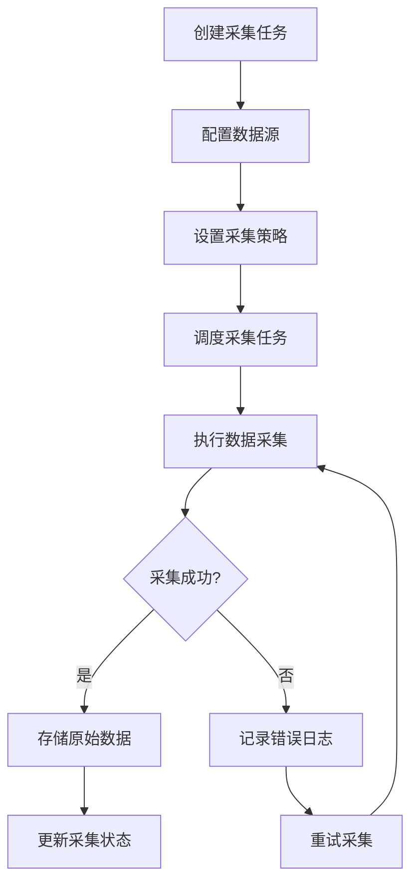
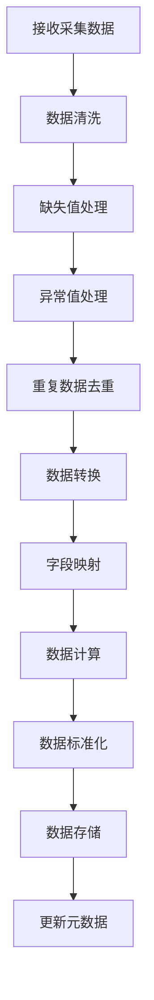
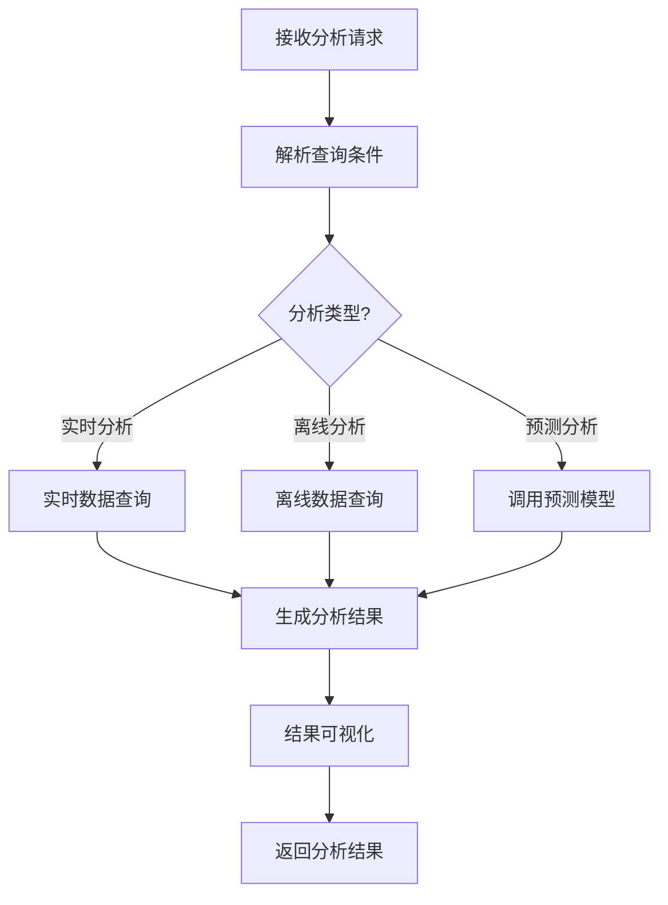
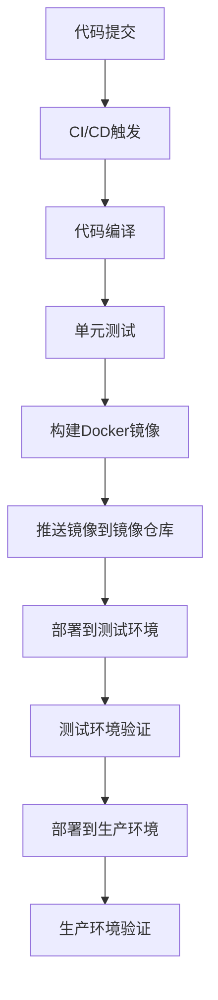

# 数据分析系统详细设计文档

## 文档基本信息
| 项目 | 内容 |
| --- | --- |
| 文档名称 | 数据分析系统详细设计文档 |
| 项目名称 | 数据分析系统 |
| 文档版本 | v1.0 |
| 作者 | AI开发专家 |
| 创建日期 | 2023-12-16 |
| 最后更新日期 | 2023-12-16 |
| 审批状态 | 草稿 |

## 一、概述

### 1.1 设计目标
本详细设计文档基于《数据分析系统需求设计文档》，详细描述数据分析系统的架构设计、数据设计、API设计、核心业务逻辑实现等内容，为开发团队提供清晰的技术实现指导。

### 1.2 设计原则
- **模块化设计**：系统采用模块化架构，各模块职责清晰，低耦合高内聚
- **可扩展性**：支持水平扩展，能够应对未来业务增长
- **高性能**：优化数据处理和查询性能，确保系统响应迅速
- **可靠性**：系统具有容错机制，确保数据安全和系统稳定
- **可维护性**：代码结构清晰，文档完善，便于后续维护和升级

### 1.3 术语定义
| 术语 | 解释 |
| --- | --- |
| ETL | Extract, Transform, Load，数据抽取、转换、加载 |
| OLAP | Online Analytical Processing，联机分析处理 |
| OLTP | Online Transaction Processing，联机事务处理 |
| 数据仓库 | 用于存储和分析历史数据的系统 |
| 数据集市 | 面向特定业务领域的数据集合 |
| 实时计算 | 对数据流进行实时处理和分析 |
| 离线计算 | 对批量数据进行处理和分析 |

## 二、架构设计

### 2.1 系统架构图
```
┌─────────────────────────────────────────────────────────────────────────┐
│                              用户层                                    │
│  ┌────────────┐  ┌────────────┐  ┌────────────┐  ┌────────────┐        │
│  │  Web端     │  │  移动端    │  │  API调用   │  │  第三方系统│        │
│  └────────────┘  └────────────┘  └────────────┘  └────────────┘        │
└─────────────────────┬───────────────────────────────────────────────────┘
                      │
┌─────────────────────▼───────────────────────────────────────────────────┐
│                             接入层                                    │
│  ┌────────────┐  ┌────────────┐  ┌────────────┐  ┌────────────┐        │
│  │  API网关   │  │  负载均衡  │  │  认证授权  │  │  限流熔断  │        │
│  └────────────┘  └────────────┘  └────────────┘  └────────────┘        │
└─────────────────────┬───────────────────────────────────────────────────┘
                      │
┌─────────────────────▼───────────────────────────────────────────────────┐
│                             业务层                                    │
│  ┌────────────┐  ┌────────────┐  ┌────────────┐  ┌────────────┐        │
│  │  数据采集  │  │  数据处理  │  │  数据分析  │  │  可视化    │        │
│  └────────────┘  └────────────┘  └────────────┘  └────────────┘        │
│  ┌────────────┐  ┌────────────┐  ┌────────────┐                        │
│  │  系统管理  │  │  权限管理  │  │  任务调度  │                        │
│  └────────────┘  └────────────┘  └────────────┘                        │
└─────────────────────┬───────────────────────────────────────────────────┘
                      │
┌─────────────────────▼───────────────────────────────────────────────────┐
│                             数据层                                    │
│  ┌────────────┐  ┌────────────┐  ┌────────────┐  ┌────────────┐        │
│  │  原始数据  │  │  处理后数据│  │  分析结果  │  │  元数据    │        │
│  └────────────┘  └────────────┘  └────────────┘  └────────────┘        │
└─────────────────────┬───────────────────────────────────────────────────┘
                      │
┌─────────────────────▼───────────────────────────────────────────────────┐
│                             基础设施层                                  │
│  ┌────────────┐  ┌────────────┐  ┌────────────┐  ┌────────────┐        │
│  │  服务器    │  │  存储系统  │  │  容器平台  │  │  监控系统  │        │
│  └────────────┘  └────────────┘  └────────────┘  └────────────┘        │
└─────────────────────────────────────────────────────────────────────────┘
```

### 2.2 技术架构
- **前端**：React 18 + TypeScript + Ant Design + ECharts + Axios
- **后端**：Python 3.9 + FastAPI + Celery + Redis
- **数据处理**：Spark 3.3 + Pandas + NumPy + Scikit-learn
- **数据库**：
  - 关系型：PostgreSQL 14（业务数据、元数据）
  - 时序数据库：InfluxDB 2.0（监控数据、时序数据）
  - 缓存：Redis 7.0（缓存、会话管理）
  - 数据仓库：ClickHouse 22.12（分析数据）
- **消息队列**：Kafka 3.0（实时数据传输）
- **实时计算**：Flink 1.15（实时数据处理）
- **容器化**：Docker + Kubernetes（部署、编排）
- **监控**：Prometheus + Grafana + ELK Stack（日志管理）

### 2.3 模块划分

| 模块 | 主要职责 | 核心组件 |
| --- | --- | --- |
| 数据采集模块 | 从各种数据源采集数据 | 数据源连接器、采集任务调度、数据采集器 |
| 数据处理模块 | 数据清洗、转换、存储 | 数据清洗器、数据转换器、数据加载器 |
| 数据分析模块 | 实时分析、离线分析、预测分析 | 实时分析引擎、离线分析引擎、预测模型 |
| 可视化模块 | 数据图表展示、仪表板定制 | 图表生成器、仪表板编辑器、报表生成器 |
| 系统管理模块 | 用户管理、权限控制、系统监控 | 用户管理器、权限控制器、系统监控器 |

### 2.4 核心流程设计

#### 2.4.1 数据采集流程


#### 2.4.2 数据处理流程


#### 2.4.3 数据分析流程


## 三、数据设计

### 3.1 数据模型

#### 3.1.1 用户表（users）
| 字段名 | 数据类型 | 约束 | 描述 |
| --- | --- | --- | --- |
| id | SERIAL | PRIMARY KEY | 用户ID |
| username | VARCHAR(50) | UNIQUE NOT NULL | 用户名 |
| password | VARCHAR(255) | NOT NULL | 密码（加密存储） |
| email | VARCHAR(100) | UNIQUE NOT NULL | 邮箱 |
| phone | VARCHAR(20) | NULL | 手机号 |
| role_id | INTEGER | NOT NULL REFERENCES roles(id) | 角色ID |
| status | INTEGER | NOT NULL DEFAULT 1 | 状态（1：启用，0：禁用） |
| created_at | TIMESTAMP | NOT NULL DEFAULT CURRENT_TIMESTAMP | 创建时间 |
| updated_at | TIMESTAMP | NOT NULL DEFAULT CURRENT_TIMESTAMP | 更新时间 |

#### 3.1.2 角色表（roles）
| 字段名 | 数据类型 | 约束 | 描述 |
| --- | --- | --- | --- |
| id | SERIAL | PRIMARY KEY | 角色ID |
| name | VARCHAR(50) | UNIQUE NOT NULL | 角色名称 |
| description | TEXT | NULL | 角色描述 |
| created_at | TIMESTAMP | NOT NULL DEFAULT CURRENT_TIMESTAMP | 创建时间 |
| updated_at | TIMESTAMP | NOT NULL DEFAULT CURRENT_TIMESTAMP | 更新时间 |

#### 3.1.3 权限表（permissions）
| 字段名 | 数据类型 | 约束 | 描述 |
| --- | --- | --- | --- |
| id | SERIAL | PRIMARY KEY | 权限ID |
| name | VARCHAR(50) | UNIQUE NOT NULL | 权限名称 |
| code | VARCHAR(50) | UNIQUE NOT NULL | 权限编码 |
| description | TEXT | NULL | 权限描述 |
| created_at | TIMESTAMP | NOT NULL DEFAULT CURRENT_TIMESTAMP | 创建时间 |
| updated_at | TIMESTAMP | NOT NULL DEFAULT CURRENT_TIMESTAMP | 更新时间 |

#### 3.1.4 角色权限表（role_permissions）
| 字段名 | 数据类型 | 约束 | 描述 |
| --- | --- | --- | --- |
| role_id | INTEGER | NOT NULL REFERENCES roles(id) | 角色ID |
| permission_id | INTEGER | NOT NULL REFERENCES permissions(id) | 权限ID |
| PRIMARY KEY | (role_id, permission_id) | | 联合主键 |

#### 3.1.5 数据源表（data_sources）
| 字段名 | 数据类型 | 约束 | 描述 |
| --- | --- | --- | --- |
| id | SERIAL | PRIMARY KEY | 数据源ID |
| name | VARCHAR(100) | NOT NULL | 数据源名称 |
| type | VARCHAR(50) | NOT NULL | 数据源类型（mysql, postgresql, mongodb, file等） |
| config | JSONB | NOT NULL | 数据源配置（连接信息等） |
| status | INTEGER | NOT NULL DEFAULT 1 | 状态（1：启用，0：禁用） |
| created_by | INTEGER | NOT NULL REFERENCES users(id) | 创建人ID |
| created_at | TIMESTAMP | NOT NULL DEFAULT CURRENT_TIMESTAMP | 创建时间 |
| updated_at | TIMESTAMP | NOT NULL DEFAULT CURRENT_TIMESTAMP | 更新时间 |

#### 3.1.6 采集任务表（collection_tasks）
| 字段名 | 数据类型 | 约束 | 描述 |
| --- | --- | --- | --- |
| id | SERIAL | PRIMARY KEY | 任务ID |
| name | VARCHAR(100) | NOT NULL | 任务名称 |
| data_source_id | INTEGER | NOT NULL REFERENCES data_sources(id) | 数据源ID |
| collection_type | VARCHAR(50) | NOT NULL | 采集类型（full, incremental, realtime） |
| schedule | VARCHAR(100) | NULL | 调度规则（Cron表达式） |
| config | JSONB | NOT NULL | 采集配置 |
| status | VARCHAR(50) | NOT NULL DEFAULT 'pending' | 状态（pending, running, completed, failed） |
| created_by | INTEGER | NOT NULL REFERENCES users(id) | 创建人ID |
| created_at | TIMESTAMP | NOT NULL DEFAULT CURRENT_TIMESTAMP | 创建时间 |
| updated_at | TIMESTAMP | NOT NULL DEFAULT CURRENT_TIMESTAMP | 更新时间 |

#### 3.1.7 数据集表（datasets）
| 字段名 | 数据类型 | 约束 | 描述 |
| --- | --- | --- | --- |
| id | SERIAL | PRIMARY KEY | 数据集ID |
| name | VARCHAR(100) | NOT NULL | 数据集名称 |
| description | TEXT | NULL | 数据集描述 |
| data_source_id | INTEGER | NOT NULL REFERENCES data_sources(id) | 数据源ID |
| schema | JSONB | NOT NULL | 数据结构 |
| size | BIGINT | NOT NULL DEFAULT 0 | 数据大小（字节） |
| record_count | BIGINT | NOT NULL DEFAULT 0 | 记录数 |
| created_by | INTEGER | NOT NULL REFERENCES users(id) | 创建人ID |
| created_at | TIMESTAMP | NOT NULL DEFAULT CURRENT_TIMESTAMP | 创建时间 |
| updated_at | TIMESTAMP | NOT NULL DEFAULT CURRENT_TIMESTAMP | 更新时间 |

#### 3.1.8 仪表板表（dashboards）
| 字段名 | 数据类型 | 约束 | 描述 |
| --- | --- | --- | --- |
| id | SERIAL | PRIMARY KEY | 仪表板ID |
| name | VARCHAR(100) | NOT NULL | 仪表板名称 |
| description | TEXT | NULL | 仪表板描述 |
| layout | JSONB | NOT NULL | 布局配置 |
| widgets | JSONB | NOT NULL | 组件配置 |
| is_public | BOOLEAN | NOT NULL DEFAULT false | 是否公开 |
| created_by | INTEGER | NOT NULL REFERENCES users(id) | 创建人ID |
| created_at | TIMESTAMP | NOT NULL DEFAULT CURRENT_TIMESTAMP | 创建时间 |
| updated_at | TIMESTAMP | NOT NULL DEFAULT CURRENT_TIMESTAMP | 更新时间 |

### 3.2 数据库设计

#### 3.2.1 关系型数据库（PostgreSQL）
- 存储业务数据、元数据等结构化数据
- 采用三范式设计，确保数据一致性和完整性
- 建立合理的索引，优化查询性能

#### 3.2.2 时序数据库（InfluxDB）
- 存储监控数据、时序数据
- 支持高性能的时间序列数据查询和分析

#### 3.2.3 数据仓库（ClickHouse）
- 存储用于分析的大规模数据
- 支持高性能的OLAP查询
- 采用列存储，优化数据压缩和查询性能

### 3.3 数据安全设计
- **数据加密**：敏感数据采用AES-256加密存储
- **数据脱敏**：用户个人信息等敏感数据在展示时进行脱敏处理
- **访问控制**：基于角色的访问控制，确保数据只能被授权用户访问
- **数据备份**：定期进行数据备份，确保数据安全

## 四、API设计

### 4.1 API设计原则
- **RESTful风格**：使用HTTP方法（GET, POST, PUT, DELETE）表示操作类型
- **统一响应格式**：所有API返回统一的JSON格式响应
- **版本控制**：API采用版本控制（如/v1/）
- **错误处理**：统一的错误码和错误信息
- **安全性**：使用JWT进行认证，HTTPS加密传输

### 4.2 核心API设计

#### 4.2.1 用户管理API
- `POST /v1/users` - 创建用户
- `GET /v1/users` - 获取用户列表
- `GET /v1/users/{id}` - 获取用户详情
- `PUT /v1/users/{id}` - 更新用户信息
- `DELETE /v1/users/{id}` - 删除用户
- `POST /v1/users/login` - 用户登录
- `POST /v1/users/logout` - 用户登出

#### 4.2.2 数据源管理API
- `POST /v1/data-sources` - 创建数据源
- `GET /v1/data-sources` - 获取数据源列表
- `GET /v1/data-sources/{id}` - 获取数据源详情
- `PUT /v1/data-sources/{id}` - 更新数据源
- `DELETE /v1/data-sources/{id}` - 删除数据源
- `POST /v1/data-sources/{id}/test` - 测试数据源连接

#### 4.2.3 采集任务管理API
- `POST /v1/collection-tasks` - 创建采集任务
- `GET /v1/collection-tasks` - 获取采集任务列表
- `GET /v1/collection-tasks/{id}` - 获取采集任务详情
- `PUT /v1/collection-tasks/{id}` - 更新采集任务
- `DELETE /v1/collection-tasks/{id}` - 删除采集任务
- `POST /v1/collection-tasks/{id}/run` - 立即执行采集任务
- `POST /v1/collection-tasks/{id}/pause` - 暂停采集任务
- `POST /v1/collection-tasks/{id}/resume` - 恢复采集任务

#### 4.2.4 数据集管理API
- `POST /v1/datasets` - 创建数据集
- `GET /v1/datasets` - 获取数据集列表
- `GET /v1/datasets/{id}` - 获取数据集详情
- `PUT /v1/datasets/{id}` - 更新数据集
- `DELETE /v1/datasets/{id}` - 删除数据集
- `GET /v1/datasets/{id}/schema` - 获取数据集结构
- `POST /v1/datasets/{id}/query` - 查询数据集数据

#### 4.2.5 数据分析API
- `POST /v1/analytics/realtime` - 实时分析
- `POST /v1/analytics/offline` - 离线分析
- `POST /v1/analytics/predict` - 预测分析
- `GET /v1/analytics/results/{id}` - 获取分析结果

#### 4.2.6 可视化API
- `POST /v1/dashboards` - 创建仪表板
- `GET /v1/dashboards` - 获取仪表板列表
- `GET /v1/dashboards/{id}` - 获取仪表板详情
- `PUT /v1/dashboards/{id}` - 更新仪表板
- `DELETE /v1/dashboards/{id}` - 删除仪表板
- `POST /v1/dashboards/{id}/publish` - 发布仪表板
- `POST /v1/charts` - 生成图表
- `POST /v1/reports` - 生成报表

### 4.3 API响应格式
```json
{
  "code": 200,
  "message": "success",
  "data": {}
}
```

## 五、核心功能实现

### 5.1 数据采集模块实现

#### 5.1.1 数据源连接器
```python
class DataSourceConnector:
    def __init__(self, data_source_type, config):
        self.data_source_type = data_source_type
        self.config = config
        self.connector = self._create_connector()
    
    def _create_connector(self):
        if self.data_source_type == "mysql":
            return MySQLConnector(self.config)
        elif self.data_source_type == "postgresql":
            return PostgreSQLConnector(self.config)
        elif self.data_source_type == "mongodb":
            return MongoDBConnector(self.config)
        elif self.data_source_type == "file":
            return FileConnector(self.config)
        else:
            raise ValueError(f"Unsupported data source type: {self.data_source_type}")
    
    def connect(self):
        return self.connector.connect()
    
    def disconnect(self):
        return self.connector.disconnect()
    
    def query(self, query):
        return self.connector.query(query)
```

#### 5.1.2 采集任务调度
```python
@app.task
def run_collection_task(task_id):
    task = CollectionTask.objects.get(id=task_id)
    data_source = DataSource.objects.get(id=task.data_source_id)
    
    try:
        # 更新任务状态为running
        task.status = "running"
        task.save()
        
        # 创建数据源连接器
        connector = DataSourceConnector(data_source.type, data_source.config)
        
        # 连接数据源
        connector.connect()
        
        # 执行数据采集
        collection_config = json.loads(task.config)
        data = connector.query(collection_config["query"])
        
        # 存储原始数据
        raw_data_storage = RawDataStorage()
        raw_data_storage.save(data, task.id)
        
        # 更新任务状态为completed
        task.status = "completed"
        task.save()
        
        # 关闭连接
        connector.disconnect()
        
    except Exception as e:
        # 更新任务状态为failed
        task.status = "failed"
        task.save()
        
        # 记录错误日志
        logger.error(f"Collection task {task_id} failed: {str(e)}")
        
        # 重试机制
        if task.retry_count < 3:
            task.retry_count += 1
            task.save()
            run_collection_task.apply_async(args=[task_id], countdown=60 * task.retry_count)
```

### 5.2 数据处理模块实现

#### 5.2.1 数据清洗器
```python
class DataCleaner:
    def __init__(self, data):
        self.data = data
        self.cleaned_data = pd.DataFrame(data)
    
    def handle_missing_values(self, strategy="mean"):
        # 处理缺失值
        if strategy == "mean":
            self.cleaned_data = self.cleaned_data.fillna(self.cleaned_data.mean())
        elif strategy == "median":
            self.cleaned_data = self.cleaned_data.fillna(self.cleaned_data.median())
        elif strategy == "mode":
            self.cleaned_data = self.cleaned_data.fillna(self.cleaned_data.mode().iloc[0])
        elif strategy == "drop":
            self.cleaned_data = self.cleaned_data.dropna()
        return self
    
    def handle_outliers(self, method="zscore", threshold=3):
        # 处理异常值
        if method == "zscore":
            z_scores = np.abs(stats.zscore(self.cleaned_data.select_dtypes(include=[np.number])))
            self.cleaned_data = self.cleaned_data[(z_scores < threshold).all(axis=1)]
        elif method == "iqr":
            Q1 = self.cleaned_data.quantile(0.25)
            Q3 = self.cleaned_data.quantile(0.75)
            IQR = Q3 - Q1
            self.cleaned_data = self.cleaned_data[~((self.cleaned_data < (Q1 - 1.5 * IQR)) | (self.cleaned_data > (Q3 + 1.5 * IQR))).any(axis=1)]
        return self
    
    def remove_duplicates(self):
        # 去重
        self.cleaned_data = self.cleaned_data.drop_duplicates()
        return self
    
    def clean(self):
        # 执行完整的数据清洗流程
        return self.handle_missing_values()
                   .handle_outliers()
                   .remove_duplicates()
                   .cleaned_data.to_dict(orient="records")
```

#### 5.2.2 数据转换器
```python
class DataTransformer:
    def __init__(self, data):
        self.data = pd.DataFrame(data)
        self.transformed_data = self.data.copy()
    
    def map_fields(self, mapping):
        # 字段映射
        self.transformed_data = self.transformed_data.rename(columns=mapping)
        return self
    
    def calculate_fields(self, calculations):
        # 数据计算
        for field, formula in calculations.items():
            self.transformed_data[field] = self.transformed_data.eval(formula)
        return self
    
    def normalize(self, fields):
        # 数据标准化
        for field in fields:
            self.transformed_data[field] = (self.transformed_data[field] - self.transformed_data[field].mean()) / self.transformed_data[field].std()
        return self
    
    def transform(self):
        # 执行完整的数据转换流程
        return self.transformed_data.to_dict(orient="records")
```

### 5.3 数据分析模块实现

#### 5.3.1 实时分析引擎
```python
class RealTimeAnalysisEngine:
    def __init__(self, config):
        self.config = config
        self.kafka_consumer = self._create_kafka_consumer()
        self.influxdb_client = self._create_influxdb_client()
    
    def _create_kafka_consumer(self):
        # 创建Kafka消费者
        consumer = KafkaConsumer(
            self.config["kafka_topic"],
            bootstrap_servers=self.config["kafka_bootstrap_servers"],
            group_id=self.config["kafka_group_id"],
            auto_offset_reset="latest",
            value_deserializer=lambda x: json.loads(x.decode("utf-8"))
        )
        return consumer
    
    def _create_influxdb_client(self):
        # 创建InfluxDB客户端
        client = InfluxDBClient(
            url=self.config["influxdb_url"],
            token=self.config["influxdb_token"],
            org=self.config["influxdb_org"]
        )
        return client
    
    def analyze(self, query):
        # 实时数据分析
        measurements = self.influxdb_client.query_api().query_data_frame(query)
        return measurements.to_dict(orient="records")
    
    def close(self):
        # 关闭连接
        self.kafka_consumer.close()
        self.influxdb_client.close()
```

#### 5.3.2 离线分析引擎
```python
class OfflineAnalysisEngine:
    def __init__(self, config):
        self.config = config
        self.clickhouse_client = self._create_clickhouse_client()
    
    def _create_clickhouse_client(self):
        # 创建ClickHouse客户端
        client = Client(
            host=self.config["clickhouse_host"],
            port=self.config["clickhouse_port"],
            user=self.config["clickhouse_user"],
            password=self.config["clickhouse_password"],
            database=self.config["clickhouse_database"]
        )
        return client
    
    def analyze(self, query):
        # 离线数据分析
        result = self.clickhouse_client.execute(query, with_column_types=True)
        columns = [column[0] for column in result[1]]
        data = [dict(zip(columns, row)) for row in result[0]]
        return data
    
    def close(self):
        # 关闭连接
        self.clickhouse_client.disconnect()
```

### 5.4 可视化模块实现

#### 5.4.1 图表生成器
```python
class ChartGenerator:
    def __init__(self, data):
        self.data = data
        self.chart = None
    
    def create_chart(self, chart_type, options):
        # 创建图表
        if chart_type == "line":
            self.chart = self._create_line_chart(options)
        elif chart_type == "bar":
            self.chart = self._create_bar_chart(options)
        elif chart_type == "pie":
            self.chart = self._create_pie_chart(options)
        elif chart_type == "scatter":
            self.chart = self._create_scatter_chart(options)
        elif chart_type == "heatmap":
            self.chart = self._create_heatmap_chart(options)
        else:
            raise ValueError(f"Unsupported chart type: {chart_type}")
        return self.chart
    
    def _create_line_chart(self, options):
        # 创建折线图
        chart_data = {
            "type": "line",
            "data": {
                "labels": [row[options["x_axis"]] for row in self.data],
                "datasets": [
                    {
                        "label": options["series_name"],
                        "data": [row[options["y_axis"]] for row in self.data],
                        "borderColor": options.get("color", "#4285F4"),
                        "fill": options.get("fill", False)
                    }
                ]
            },
            "options": options.get("chart_options", {})
        }
        return chart_data
    
    def _create_bar_chart(self, options):
        # 创建柱状图
        chart_data = {
            "type": "bar",
            "data": {
                "labels": [row[options["x_axis"]] for row in self.data],
                "datasets": [
                    {
                        "label": options["series_name"],
                        "data": [row[options["y_axis"]] for row in self.data],
                        "backgroundColor": options.get("color", "#4285F4")
                    }
                ]
            },
            "options": options.get("chart_options", {})
        }
        return chart_data
    
    def _create_pie_chart(self, options):
        # 创建饼图
        chart_data = {
            "type": "pie",
            "data": {
                "labels": [row[options["label_field"]] for row in self.data],
                "datasets": [
                    {
                        "data": [row[options["value_field"]] for row in self.data],
                        "backgroundColor": options.get("colors", ["#4285F4", "#34A853", "#FBBC05", "#EA4335"])
                    }
                ]
            },
            "options": options.get("chart_options", {})
        }
        return chart_data
```

## 六、非功能性需求实现

### 6.1 性能优化
- **数据缓存**：使用Redis缓存频繁查询的数据
- **查询优化**：建立合理的索引，优化SQL查询
- **并行处理**：使用多线程、多进程并行处理数据
- **异步处理**：使用Celery处理耗时任务
- **数据分区**：对大规模数据进行分区存储和查询

### 6.2 安全实现
- **认证授权**：使用JWT进行认证，基于角色的访问控制
- **数据加密**：HTTPS加密传输，敏感数据加密存储
- **SQL注入防护**：使用参数化查询，避免SQL注入
- **XSS防护**：前端输入验证和转义，避免跨站脚本攻击
- **CSRF防护**：使用CSRF令牌，防止跨站请求伪造

### 6.3 可用性实现
- **负载均衡**：使用Nginx进行负载均衡，提高系统可用性
- **容错机制**：实现服务降级、熔断、限流等容错机制
- **自动恢复**：系统故障时自动恢复，减少停机时间
- **备份恢复**：定期进行数据备份，确保数据安全

### 6.4 可观测性实现
- **日志管理**：使用ELK Stack收集和分析日志
- **监控系统**：使用Prometheus和Grafana监控系统性能
- **告警机制**：设置异常告警，及时发现和处理问题
- **追踪系统**：使用Jaeger进行分布式追踪，定位性能瓶颈

## 七、部署与配置

### 7.1 部署架构
```
┌─────────────────────────────────────────────────────────────────────────┐
│                           Kubernetes集群                              │
│  ┌─────────────────┐  ┌─────────────────┐  ┌─────────────────┐          │
│  │  前端服务Pod   │  │  前端服务Pod   │  │  前端服务Pod   │          │
│  └─────────────────┘  └─────────────────┘  └─────────────────┘          │
│                  │                  │                  │                 │
│                  ▼                  ▼                  ▼                 │
│  ┌─────────────────────────────────────────────────────────┐             │
│  │                        Ingress                          │             │
│  └─────────────────────────────────────────────────────────┘             │
│                  │                  │                  │                 │
│                  ▼                  ▼                  ▼                 │
│  ┌─────────────────┐  ┌─────────────────┐  ┌─────────────────┐          │
│  │  后端服务Pod   │  │  后端服务Pod   │  │  后端服务Pod   │          │
│  └─────────────────┘  └─────────────────┘  └─────────────────┘          │
│                  │                  │                  │                 │
│                  ▼                  ▼                  ▼                 │
│  ┌─────────────────┐  ┌─────────────────┐  ┌─────────────────┐          │
│  │   Redis Pod     │  │  PostgreSQL Pod │  │  ClickHouse Pod │          │
│  └─────────────────┘  └─────────────────┘  └─────────────────┘          │
│                  │                  │                  │                 │
│                  ▼                  ▼                  ▼                 │
│  ┌─────────────────┐  ┌─────────────────┐  ┌─────────────────┐          │
│  │   Kafka Pod     │  │  InfluxDB Pod  │  │   Flink Pod     │          │
│  └─────────────────┘  └─────────────────┘  └─────────────────┘          │
└─────────────────────────────────────────────────────────────────────────┘
```

### 7.2 配置管理
- **环境变量**：使用环境变量管理配置，如数据库连接信息、API密钥等
- **配置文件**：使用YAML或JSON格式的配置文件，管理系统参数
- **配置中心**：使用Nacos或Consul作为配置中心，集中管理配置
- **版本控制**：配置文件纳入版本控制，确保配置的可追溯性

### 7.3 部署流程


## 八、测试设计

### 8.1 测试策略
- **单元测试**：测试最小的功能单元，如函数、方法等
- **集成测试**：测试模块之间的交互，如API接口测试
- **系统测试**：测试整个系统的功能和性能
- **性能测试**：测试系统的性能指标，如响应时间、吞吐量等
- **安全测试**：测试系统的安全性，如漏洞扫描、渗透测试等
- **回归测试**：确保修改不会影响现有功能

### 8.2 测试用例设计

#### 8.2.1 数据采集模块测试用例
| 测试用例ID | 测试用例名称 | 测试步骤 | 预期结果 |
| --- | --- | --- | --- |
| TC-001 | MySQL数据源连接测试 | 1. 创建MySQL数据源<br>2. 测试数据源连接 | 连接成功 |
| TC-002 | 采集任务创建测试 | 1. 创建采集任务<br>2. 验证任务创建成功 | 任务状态为pending |
| TC-003 | 采集任务执行测试 | 1. 执行采集任务<br>2. 验证采集结果 | 任务状态为completed，数据采集成功 |
| TC-004 | 采集任务失败重试测试 | 1. 创建错误的采集任务<br>2. 验证重试机制 | 任务重试3次，状态为failed |

#### 8.2.2 数据处理模块测试用例
| 测试用例ID | 测试用例名称 | 测试步骤 | 预期结果 |
| --- | --- | --- | --- |
| TC-005 | 缺失值处理测试 | 1. 准备包含缺失值的数据<br>2. 执行数据清洗<br>3. 验证缺失值处理结果 | 缺失值被正确处理 |
| TC-006 | 异常值处理测试 | 1. 准备包含异常值的数据<br>2. 执行数据清洗<br>3. 验证异常值处理结果 | 异常值被正确处理 |
| TC-007 | 重复数据去重测试 | 1. 准备包含重复数据的数据<br>2. 执行数据清洗<br>3. 验证重复数据处理结果 | 重复数据被正确去重 |
| TC-008 | 数据转换测试 | 1. 准备原始数据<br>2. 执行数据转换<br>3. 验证转换结果 | 数据转换正确，符合预期格式 |

#### 8.2.3 数据分析模块测试用例
| 测试用例ID | 测试用例名称 | 测试步骤 | 预期结果 |
| --- | --- | --- | --- |
| TC-009 | 实时分析测试 | 1. 准备实时数据<br>2. 执行实时分析<br>3. 验证分析结果 | 分析结果正确，响应时间<2秒 |
| TC-010 | 离线分析测试 | 1. 准备离线数据<br>2. 执行离线分析<br>3. 验证分析结果 | 分析结果正确，响应时间<5秒 |
| TC-011 | 预测分析测试 | 1. 准备历史数据<br>2. 训练预测模型<br>3. 执行预测分析<br>4. 验证预测结果 | 预测结果准确率>80% |

## 九、风险评估与应对

| 风险ID | 风险描述 | 风险等级 | 应对措施 |
| --- | --- | --- | --- |
| R001 | 实时数据处理性能不足 | 高 | 1. 优化数据处理算法<br>2. 增加计算资源<br>3. 使用缓存技术 |
| R002 | 大规模数据存储成本过高 | 中 | 1. 数据压缩<br>2. 数据分层存储<br>3. 数据生命周期管理 |
| R003 | 数据安全问题 | 高 | 1. 数据加密<br>2. 访问控制<br>3. 安全审计<br>4. 定期安全评估 |
| R004 | 系统可用性不足 | 高 | 1. 负载均衡<br>2. 容错机制<br>3. 自动恢复<br>4. 定期备份 |
| R005 | 技术依赖风险 | 中 | 1. 选择成熟的技术栈<br>2. 建立技术储备<br>3. 制定应急预案 |
| R006 | 需求变更风险 | 中 | 1. 需求管理<br>2. 变更控制流程<br>3. 灵活的架构设计 |

## 十、总结

本详细设计文档详细描述了数据分析系统的架构设计、数据设计、API设计、核心业务逻辑实现等内容，为开发团队提供了清晰的技术实现指导。系统采用模块化架构，各模块职责清晰，低耦合高内聚，具有良好的可扩展性、高性能、可靠性和可维护性。

在实现过程中，应严格按照本设计文档的要求进行开发，并注意以下几点：
1. 遵循代码规范和最佳实践
2. 确保系统安全性和稳定性
3. 进行充分的测试和验证
4. 及时更新文档，保持文档与代码的一致性

---

**文档审批记录**

| 审批角色 | 姓名 | 审批日期 | 审批意见 |
| --- | --- | --- | --- |
| 技术负责人 | | | |
| 架构师 | | | |
| 项目经理 | | | |